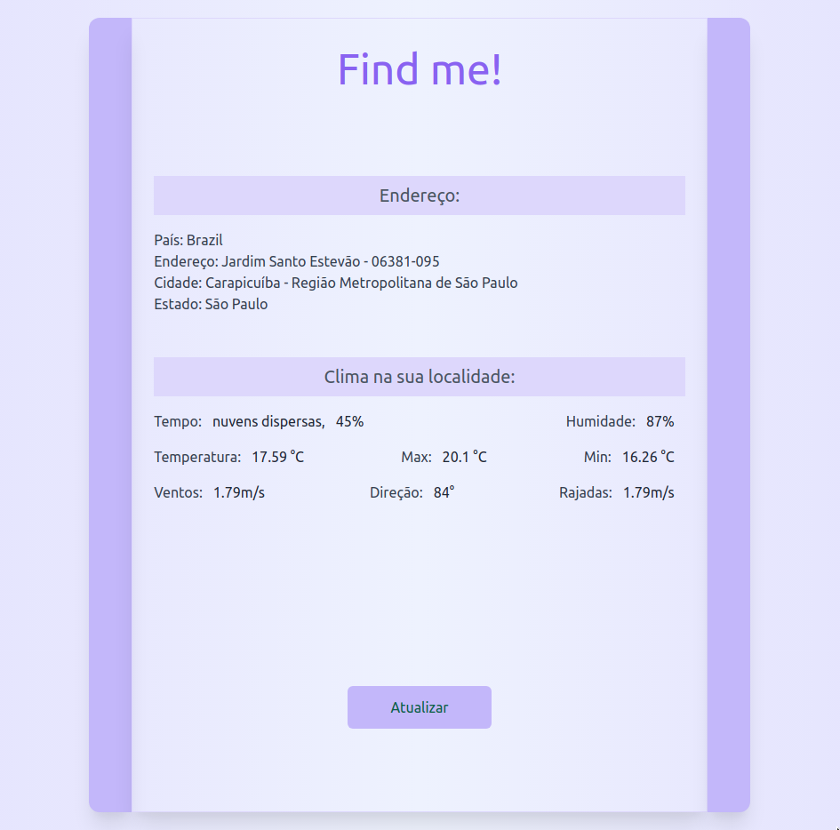

# Find me!

With your location you will be informed of weather data in the region.

    <a href="https://find-me-location.herokuapp.com/">🔗 Access here.</a>

## Available Scripts

In the project directory, you can run:

## Run development:

#### `yarn start`

## Run build:

#### `yarn build`

#

